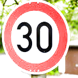
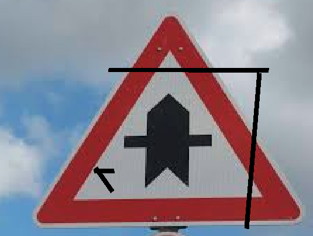
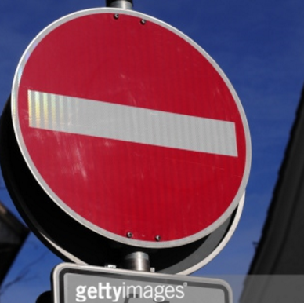

# **Traffic Sign Recognition**
### Liang Xu
### Aug/24/2017
---

**Build a Traffic Sign Recognition Project**

The goals / steps of this project are the following:
* Load the data set (see below for links to the project data set)
* Explore, summarize and visualize the data set
* Design, train and test a model architecture
* Use the model to make predictions on new images
* Analyze the softmax probabilities of the new images
* Summarize the results with a written report

[//]: # (Image References)

[image1]: ./examples/visualization.jpg "Visualization"
[image2]: ./examples/grayscale.jpg "Grayscaling"
[image3]: ./examples/random_noise.jpg "Random Noise"
[image4]: ./examples/placeholder.png "Traffic Sign 1"
[image5]: ./examples/placeholder.png "Traffic Sign 2"
[image6]: ./examples/placeholder.png "Traffic Sign 3"
[image7]: ./examples/placeholder.png "Traffic Sign 4"
[image8]: ./examples/placeholder.png "Traffic Sign 5"

## Rubric Points
#### Here I will consider the [rubric points](https://review.udacity.com/#!/rubrics/481/view) individually and describe how I addressed each point in my implementation.  

---

### Data Set Summary & Exploration
You're reading it! and here is a link to my [project code](https://github.com/abysmalocean/SelfDrivingCar_Term1/tree/master/2_Project/CarND-Traffic-Sign-Classifier-Project).
I used the pandas library to calculate summary statistics of the traffic
signs data set:

* The size of training set is 34799
* The size of the validation set is 4410
* The size of test set is 12630
* The shape of a traffic sign image is [32, 32, 3]
* The number of unique classes/labels in the data set is 43

####2. Include an exploratory visualization of the dataset.

Here is an exploratory visualization of the data set. It is a bar chart showing how the data ...

Here is a list of traffic signs

### Design and Test a Model Architecture

#### 1. Describe how you preprocessed the image data. What techniques were chosen and why did you choose these techniques? Consider including images showing the output of each preprocessing technique. Pre-processing refers to techniques such as converting to grayscale, normalization, etc. (OPTIONAL: As described in the "Stand Out Suggestions" part of the rubric, if you generated additional data for training, describe why you decided to generate additional data, how you generated the data, and provide example images of the additional data. Then describe the characteristics of the augmented training set like number of images in the set, number of images for each class, etc.)

**Answer**
I have applied the similar normalization technique with the paper [Traffic Sign Recognition with Multi-Scale Convolutional Networks](http://yann.lecun.com/exdb/publis/pdf/sermanet-ijcnn-11.pdf)
First, increase the number of the image. I did it very simple way. Every picture have 20 duplicated but not the same pictures. The duplicated image created by random the effect. So each duplicated picture are created by shear, rotate, translate and blur. Not every effect is applied to the image, only randomized. All the effect have genereated by random also.

Here is an example of a traffic sign image before and after add some effect.
#### Translate the Image:

#### image shear

#### image blur

#### image gamma

#### image rotate

As a last step, I normalized the image data because ...

Then images were transformed in the YUV space and adjusted by histogram sketching and by increasing sharpness.

#### 2. Describe what your final model architecture looks like including model type, layers, layer sizes, connectivity, etc.) Consider including a diagram and/or table describing the final model.

#### Question2 Answer
My final model consisted of the following layers:

| Layer         		|     Description	        					|
|:---------------------:|:---------------------------------------------:|
| Input         		| 32x32x1 Y channel image							|
| Convolution 5x5   | 1x1 stride, same padding, outputs 28x28x6 	|
| RELU					    |												|
| Max pooling	      	| input 28*28*6,  outputs 14x14x6 				|
| Convolution 5x5	    | 1x1 stride, valid padding, outputs 10x10x16 |
| RELU					|												|
| Max pooling	      	| input 10*10*16,  outputs 5x5x16 				|
| Flatten 	      	| Input = 5x5x16. Output = 400 				|
| Fully connected		| Input = 400. Output = 120        									|
| RELU					|												|
| Dropout					|		Dropout rate 0.3										|
| Fully connected		| Input = 120. Output = 84        									|
| RELU					|												|
| Dropout					|		Dropout rate 0.3										|
| Fully connected		| Input 84 output 43        									|
| Softmax				| etc.        									|

#### 3. Describe how you trained your model. The discussion can include the type of optimizer, the batch size, number of epochs and any hyperparameters such as learning rate.

I trained the model using the same as LeNet. Use Adam optimizer, learning rate 0.001 , BATCH_SIZE = 128, EPOCHS = 200, dropout rate is 0.4.

#### 4. Describe the approach taken for finding a solution and getting the validation set accuracy to be at least 0.93. Include in the discussion the results on the training, validation and test sets and where in the code these were calculated. Your approach may have been an iterative process, in which case, outline the steps you took to get to the final solution and why you chose those steps. Perhaps your solution involved an already well known implementation or architecture. In this case, discuss why you think the architecture is suitable for the current problem.

For this project I have choose a well know architecture called LeNet, this particular Deep Learning network has been shown it ability to image classification. The learning rate is 0.001 after try and error. This deep network has shown it ability to distinguish the hand writing, it show also good for traffic sign classification.

What was the first architecture that was tried and why was it chosen?

- The first mode I have chosen is the traditional LeNet model I have learned in the class. This model is simple and I have practiced this model also.

What were some problems with the initial architecture?
- There are not particular problem, just want to improve the total accuracy of the validation data set. After several round, I found out the accuracy of validation data set is not improving.

How was the architecture adjusted and why was it adjusted?
- I decide to add two dropout layer. And add more image by change the original image. I believe this because the model is too believe the training data. Dropout would be better choice.

Which parameters were tuned? How were they adjusted and why?
- two dropout layer added to the network, I have to choose the dropout rate. I have run the model several times in order to get the best result.

What are some of the important design choices and why were they chosen?
- add more image to the data set.
  - more data set had been added to the tanning data set by translate, shear, and other effect to the original tanning image.

My final model results were:
* training set accuracy of 0.982
* validation set accuracy of 0.942
* test set accuracy of 0.927

### Test a Model on New Images

#### 1. Choose five German traffic signs found on the web and provide them in the report. For each image, discuss what quality or qualities might be difficult to classify.

Here are five German traffic signs that I found on the web:

Those are the test image I am going to use in the following section. Those images are not prefect. None of those images are prefect. the first image is to bright, which make the prediction a little bit hard. I have created wired signs on the second iamge(11.png), this the distribution will affect the prediction also.
the third image (stop sign) has been block 1/5 of the sing. The fourth image is a skew image. But I think this is most easy one. The fifth image has large noise.

#### 2. Discuss the model's predictions on these new traffic signs and compare the results to predicting on the test set. At a minimum, discuss what the predictions were, the accuracy on these new predictions, and compare the accuracy to the accuracy on the test set (OPTIONAL: Discuss the results in more detail as described in the "Stand Out Suggestions" part of the rubric).

Here are the results of the prediction:

                Image                 |              Prediction
:-----------------------------------: | :-----------------------------------:
Right-of-way at the next intersection | Right-of-way at the next intersection
                Stop                  |                 Stop
             Ahead only               |              Ahead only
             Speed limit (30km/h)     |             **Speed limit(50km/h)**
              No entry                |               No entry

One of the classification is not correct. I think the image effect added to the training data confuse the network to make the wrong prediction. 

The model was able to correctly guess 4 of the 5 traffic signs, which gives an accuracy of 80%. This compares favorably to the accuracy on the test set of ...

#### 3. Describe how certain the model is when predicting on each of the five new images by looking at the softmax probabilities for each prediction. Provide the top 5 softmax probabilities for each image along with the sign type of each probability. (OPTIONAL: as described in the "Stand Out Suggestions" part of the rubric, visualizations can also be provided such as bar charts)

The code for making predictions on my final model is located in the 11th cell of the Ipython notebook.

For the first image, the model is relatively sure that this is a Right-of-way at the next intersection sign (probability of 0.88), and the image does contain a Right-of-way at the next intersection sign. The top five soft max probabilities were
Probability |              Prediction
:---------: | :-----------------------------------:
  0.96756   | Right-of-way at the next intersection
  0.03173   |          Beware of ice/snow
  0.00022   |               Road work
  0.00021   |             Double curve
  0.00016   |           Children crossing

For the second image, the prediction is very clear, it is a "Stop" sign.

Probability |      Prediction
:---------: | :------------------:
  0.84335   |         Stop
  0.09127   | Roundabout mandatory
  0.02986   |      Keep right
  0.01187   |      Keep left
  0.00789   |   Turn right ahead

For the third image: The prediction also very clear it is a Ahead Only:

Probability |      Prediction
:---------: | :------------------:
  0.40103   |      Ahead only
  0.11454   |        Yield
  0.06607   |    Priority road
  0.04422   | Go straight or right
  0.04275   |   Turn right ahead

For the fourth image: The prediction also very clear it is a speed limit (30km/h) Only. The top 5 predictions are all speed limit sign **Missprediction**

Probability |      Prediction
:---------: | :------------------:
  0.97408   | Speed limit (50km/h)
  0.02543   | Speed limit (30km/h)
  0.00026   | Speed limit (60km/h)
  0.00011   | Speed limit (80km/h)
  0.00011   | Speed limit (20km/h)

For the last image: The prediction also very clear it is a No entry. The top 5 predictions are all speed limit sign

Probability |     Prediction
:---------: | :-----------------:
  0.98171   |      No entry
  0.01794   |    Priority road
  0.00014   | Go straight or left
  0.00008   |     Ahead only
  0.00005   |  Turn right ahead
